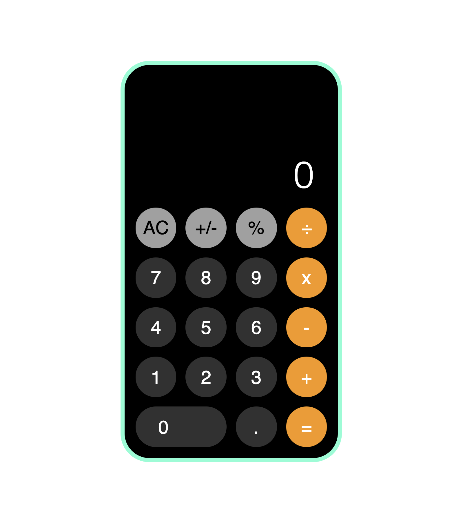

# iPhone Calculator 

## About This Project
This project is an in-browser calculator that seeks to mimic the iphone calculator.

## Some Useful Features
- Numbers never overflow the screen.
  - As the user inputs longer numbers, the font size dynamically decreases until the maximum number of digits have been used. 
  - The solution panel does however not have a maximum number size as the solution is rounded and converted into scientific notation when necessary.

## Made With
This is a web application made using HTML, CSS and Vanilla JavaScript. 

## Preview
 

---
## Try It Out
InsertLink.com
